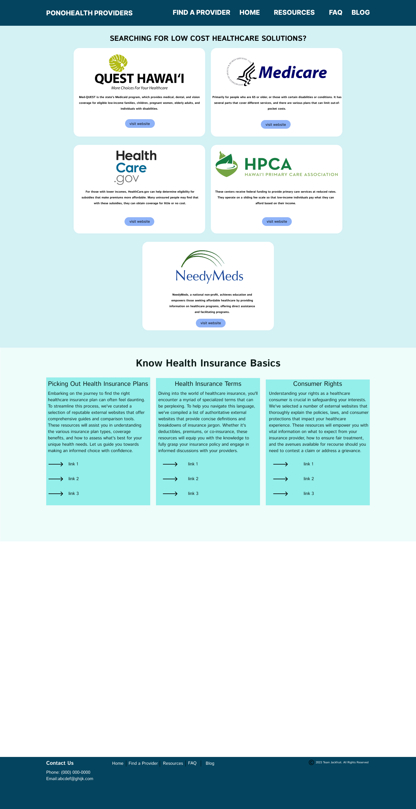

# Team Jackfruit

*A web application designed to guide uninsured and underinsured individuals in Hawaii to various healthcare options. It aggregates and simplifies information about various healthcare services, providing an easy-to-navigate platform that points users to the most relevant and cost-effective healthcare solutions.*

**Table of Contents**

   - [The Problem](#the-problem)
   - [Overview](#overview)
   - [Deployment](#deployment)
   - [User Guide](#user-guide)
   - [Development History](#development-history)
   - [Contact Us](#contact-us)

## The Problem

Access to affordable healthcare is a significant issue in Hawaii. Uninsured or underinsured individuals often struggle to find information about healthcare services that they can afford, leading to delayed or no care.

## Overview

*Approach*: *The web application will operate without storing personal user data, ensuring privacy and compliance with regulations. The application will feature:*

* **User Profiles**: Users can indicate their insurance status (insured, uninsured, or underinsured) and their healthcare needs.

* **Directory**: A comprehensive listing of healthcare facilities, services offered, and costs, filterable by various criteria.

## Implementation

*Meteor:* Javascript-based implementation for the client and server code  
*Bootstrap 5:* Creates a professional-looking user interface 

## User Guide
### Mockup Page Ideas
**Landing Page**: Welcomes Users to the site, provides a mission statement of the website and lists the services provided.

**Directory Page**: Lists healthcare services, allowing filtering by location, cost, services, and insurance accepted.

**Resources Page**: Lists additional resources for users, including links to government programs and other organizations.

## Development History

## Contact Us

